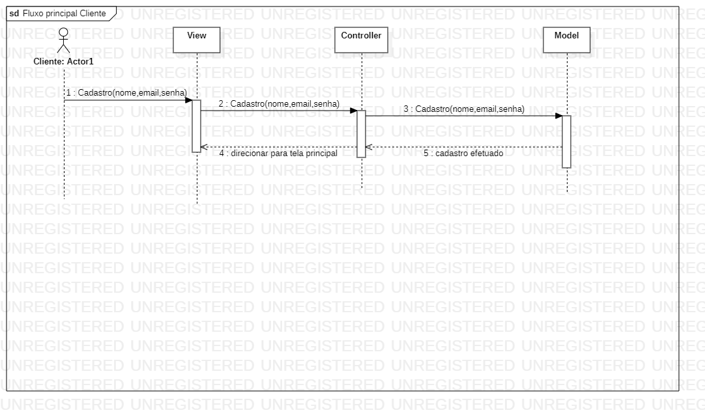
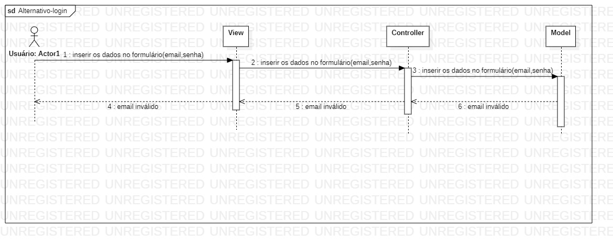
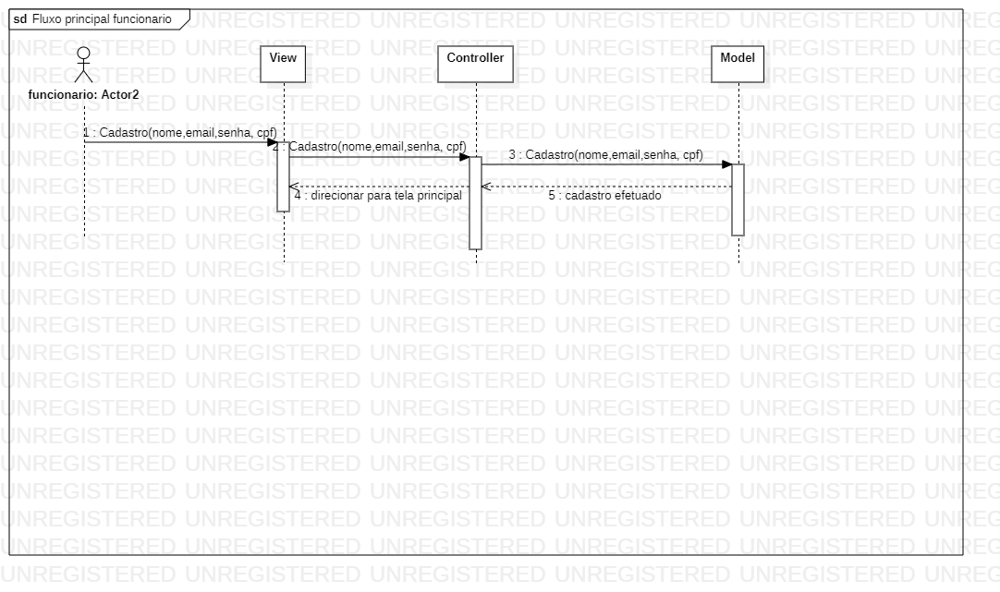
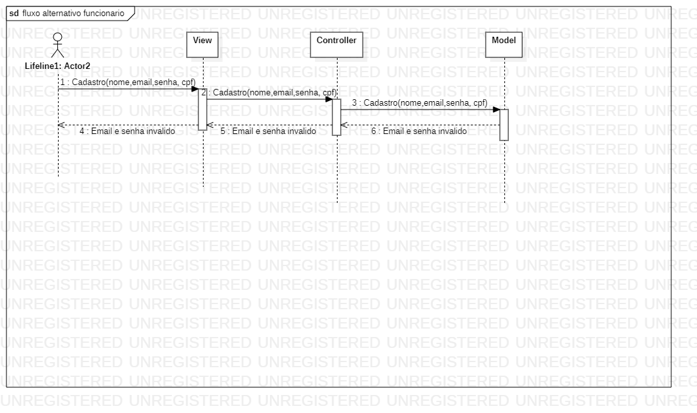
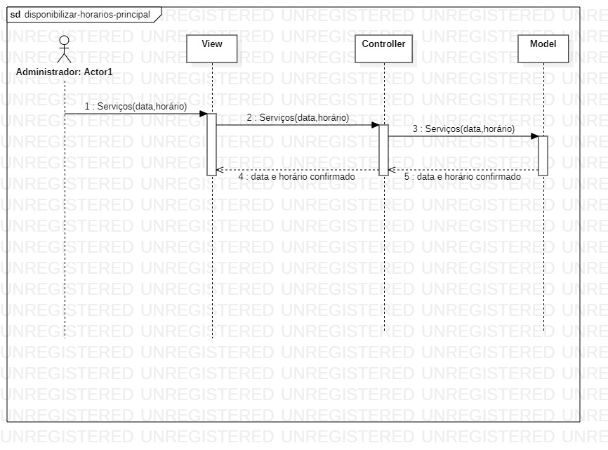
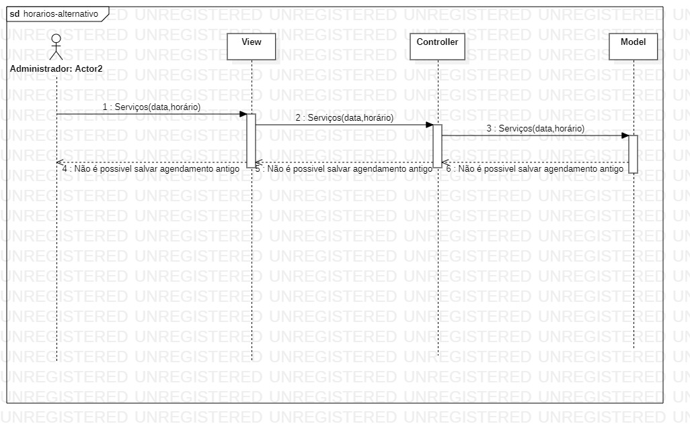

# Documento de Casos de Uso

## Lista dos Casos de Uso

 - [CDU 01](#CDU-01): Cadastrar cliente;
 - [CDU 02](#CDU-02): Cadastro de Serviço;
 - [CDU 03](#CDU-03): Listar clientes cadastrados;
 - [CDU 04](#CDU-04): Visualizar agendamento;
 - [CDU 05](#CDU-05): Cancelar agendamento;
 - [CDU 06](#CDU-06): Excluir cliente;
 - [CDU 07](#CDU-07): Efetuar login;
 - [CDU 08](#CDU-08): Adição de Funcionário;
 - [CDU 09](#CDU-09): Disponibilização de horários;
 - [CDU 10](#CDU-10): Agendamento;
 - [CDU 11](#CDU-11): Logout;
 

 

 
## Lista dos Atores

 - Cliente;
 - Funcionários; 
 - Administrador;

## Diagrama de Casos de Uso

## Descrição dos Casos de Uso

### CDU 01 Cadastrar cliente

**Fluxo Principal**

1. O sistema possuirá uma tela de cadastro com um formulário.
2. O cliente irá inserir os dados no formulário (nome, e-mail e senha).
3. O cliente irá enviar os dados para o sistema clicando no botão "Enviar".
4. O cliente será redirecionado para outra página com o aviso "Cadastro efetuado!". 

**Fluxo Alternativo**

1. O sistema possuirá uma tela de cadastro com um formulário.
2. O cliente irá inserir os dados no formulário (nome, e-mail e senha).
4. O cliente irá enviar os dados para o sistema clicando no botão "Enviar".
5. O sistema informará ao cliente que o email e senha estão inválidos.
6. O cliente digitará corretamente email e senha.
7. O cliente clica em "Enviar".
8. O cliente será redirecionado para outra página com o aviso "Cadastro efetuado!".
 
 
### CDU 02 Cadastro de Serviço

 **Fluxo Principal**

1. O sistema exibirá os horários e os profissionais cadastrados na região do cliente.
2. O cliente irá escolher o horário e profissional de sua preferência. 
3. O cliente irá clicar em "Agendamento".
4. O cliente será redirecionado para outra página com o aviso "Agendamento efetuado!". 

**Fluxo Alternativo**

1. O sistema exibirá os horários e os profissionais cadastrados na região do cliente.
2. O cliente irá escolher o horário e profissional de sua preferência. 
3. O cliente irá clicar em "Agendamento".
4. O sistema informará que o profissional não está disponivel.
5. O cliente escolherá outro profissional.
6. O cliente irá clicar em "Agendamento".
7. O cliente será redirecionado para outra página com o aviso "Agendamento efetuado!". 
 

### CDU 03 Listar clientes cadastrados

**Fluxo Principal**

1. O administrador possuirá uma interface própria.
2. Nessa interface possuirá um botão "Listar usuarios".
3. O administrador clica nesse botão e será redirecionado para outra página.
4. Essa página possuirá todos os usuarios cadastrados.
5. O administrador poderá editar cadastros.

**Fluxo Alternativo**

1. O administrador clica no botão "clientes".
2. O administrador seleciona um cliente.
3. O administrador tentará editar o cadastro.
4. Será exibido a mensagem de que o cadastro foi editado.

### CDU 04 Visualizar agendamento

**Fluxo Principal**

1. O administrador e o funcionário poderão ver os agendamentos feitos pelos clientes.
2. Na interface do profissional terá uma mensagem "agendamentos".
3. O administrador poderá ver seus agendamentos.

### CDU 05 Cancelar agendamento

**Fluxo Principal**
1. Na interface do administrador terá a página "agendamentos" .
2. Dentro da página "agendamentos" cada agendamento que ainda não teve seu serviço prestado terá o botão "cancelar". 
3. O administrador clicará no botão "cancelar" e uma mensagem "Gostaria de cancelar esse agendamendo?" será exibida.
4. O administrador clicará em "sim" e a mensagem "cancelamento feito com sucesso!!"

### CDU 06 Excluir cliente 

**Fluxo principal**

1. Na interface do administrador terá a página "Clientes".
2. Dentro da página "Clientes" terá o botão "excluir". 
3. O administrador clicará no botão "excluir" e uma mensagem de "Gostaria de excluir esse cliente?" será exibida.
4. O administrador clicará em "sim" e excluirá o cliente. 

**Fluxo alternativo**

1. Na interface do administrador terá a página "Clientes".
2. Dentro da página "Clientes" terá o botão "excluir". 
3. O administrador clicará no botão "excluir" e uma mensagem de "Gostaria de excluir esse cliente?" será exibida.
4. O administrador clicará em "não" e não excluirá o cliente. 

### CDU 07 Login

**Fluxo Principal**

1. O sistema exibirá a página inicial do programa.
2. O cliente clica em "Login".
3. O cliente será redirecionado para a página de login.
4. Será exibido os campos de email e senha.
5. Cliente entra com email e senha.
6. O cliente clica em "enviar".
7. O sistema verifica as informações fornecidas pelo usuário.
8. O cliente está logado ao sistema.
 
 

**Fluxo Alternativo**

1. O sistema exibirá a página inicial do programa.
2. O cliente clica em "Login".
3. O cliente será redirecionado para a página de login.
4. Será exibido os campos de email e senha.
5. Cliente entra com email e senha.
6. O cliente em "enviar".
7. O sistema verifica as informações fornecidas pelo usuário, e então retorna "email inválido" ou "senha inválida" caso não reconheça os dados inseridos.
8. O usuário corrige os dados incorretos, clica em enviar.
9. O programa reconhece novamente os dados, e então o direciona para a página principal caso estejam corretos, se não, repete o processo.

 
 
 ### CDU 08 Adição de funcionários 

**Fluxo principal** 

1. No sistema existirá uma página de controle para os administradores. 
2. O administrador terá acesso a todos os perfis de clientes que se cadastraram. 
3. O administrador terá que cadastrar seu funcionário no sistema. 
4. Após cadastrado, o funcionário terá acesso ao sistema através de seu email e senha.

**Fluxo Alternativo**

 
  ### CDU 09 Disponibilização de horários

**Fluxo principal**  
1. O administrador selecionará serviços
2. O sistema exibirá ao administrador a lista de serviços
3. O administrador selecionará data e horários disponíveis 
4. O sistema confirmará data e horário

**Fluxo Alternativo** 
1. O administrador selecionará serviços
2. O sistema exibirá ao administrador a lista de serviços
3. O administrador selecionará a mesma data e horário   
4. O sistema exibirá que não é possível salvar agendamentos antigos.

 ### CDU 10 **Agendamento**
 
**Fluxo principal**
1. O cliente selecionará serviços para escolher data e horário 
2. O sistema confirmará o agendamento
3. O sistema exibirá "agendamento cadastrado"
4. O sistema recarrega para página inicial

**Fluxo Alternativo**  
1. O cliente selecionará serviços para escolher data e horário 
2. O sistema confirmará o agendamento
3. O sistema exibirá "agendamento indisponível"
4. O sistema recarrega a página inicial
5. O cliente refaz o agendamento 
6. O cliente escolhe nova data e horário
7. O sistema exibirá "agendamento cadastrado"
8. O sistema recarrega para página inicial

- [CDU 11](#CDU-11): Logout;
1.  O cliente selecionará "Sair"
2.  O sistema confirmará saída
3.  O sistema recarrega para página inicial

**Fluxo Alternativo** 

